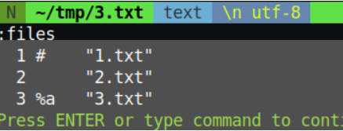
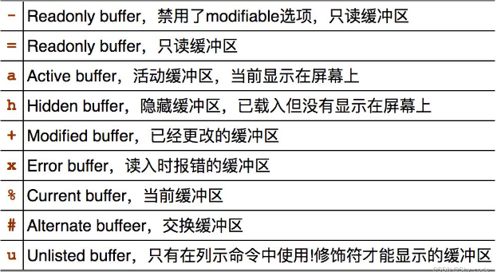

## Buffer
#### 在 Vim 中打开文件
```shell
#打开名为 filename 的文件，若文件不存在则创建
:e <filename>

#在 Vim 中打开目录树，光标选中后回车打开对应文件（提示：- 进入上级目录）
:Ex
```

#### 如何创建缓冲区
```shell
#同时打开多个文件
vim 1.txt 2.txt

#在vim的命令模式下使用vim打开文件
:o 3.txt 或者 :vim 3.txt
```

#### 如何查看缓冲区
- 查看缓冲区可以使用一下3个指令
```shell
:ls

:files

:buffers
```



####  如何切换缓冲区
```shell
#vim命令模式下  buffer + 文件名或编号（上图的1、2、3）
#文件名的1、2、3与编号的1、2、3没有一点关系，无论是什么文件名编号都是1、2、...
:buffer 1.txt

:buffer 1
```
